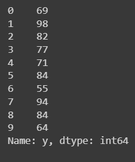

# Implementation-of-Simple-Linear-Regression-Model-for-Predicting-the-Marks-Scored

## AIM:
To write a program to predict the marks scored by a student using the simple linear regression model.

## Equipments Required:
1. Hardware – PCs
2. Anaconda – Python 3.7 Installation / Jupyter notebook

## Algorithm
1.Import Pandas as pd & Import numpy as np

2.Calulating The y_pred & y_test

3.Find the graph for Training set & Test Set

4.Find the values of MSE,MSA,RMSE

## Program:
``````
Program to implement the simple linear regression model for predicting the marks scored.
Developed by: SANIYA G
RegisterNumber:  212223240147

import pandas as pd
import numpy as np
import matplotlib.pyplot as plt

df=pd.read_csv('/content/Book.csv')
df.head(10)

plt.scatter(df['x'],df['y'])
plt.xlabel('x')
plt.ylabel('y')

x=df.iloc[:,0:1]
y=df.iloc[:,-1]
y

from sklearn.model_selection import train_test_split
x_train,x_test,y_train,y_test=train_test_split(x,y,test_size=0.2,random_state=0)

from sklearn.linear_model import LinearRegression

lr=LinearRegression()
lr.fit(x_train,y_train)

x_train
y_train

lr.predict(x_test.iloc[0].values.reshape(1,1))

plt.scatter(df['x'],df['y'])
plt.xlabel('x')
plt.ylabel('y')
plt.plot(x_train,lr.predict(x_train),color='red')
``````

## Output:
# df.head():

# Plot:

# iloc:

# Training:

# Graph:


# COEFFICIENT AND INTERCEPT VALUES:


## Result:
Thus the program to implement the simple linear regression model for predicting the marks scored is written and verified using python programming.
